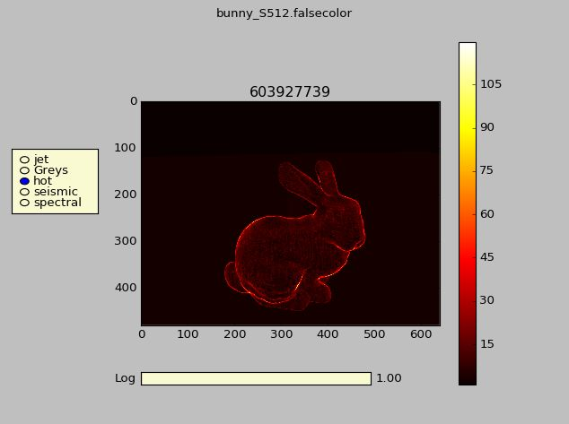

[![License][s1]][li]

[s1]: https://img.shields.io/badge/licence-GPL%203.0-blue.svg
[li]: https://raw.githubusercontent.com/matt77hias/FalseColor/master/LICENSE.txt

# FalseColor
FalseColor utilities

## About
A visualization tool for False Color data files.

## Use

1. Change path to your `...\FalseColor\src\falsecolor.py` in your `...\FalseColor\run.bat`.
2. Associate `.falsecolor` files with `...\FalseColor\run.bat`.
3. Double click a `.falsecolor` file.
